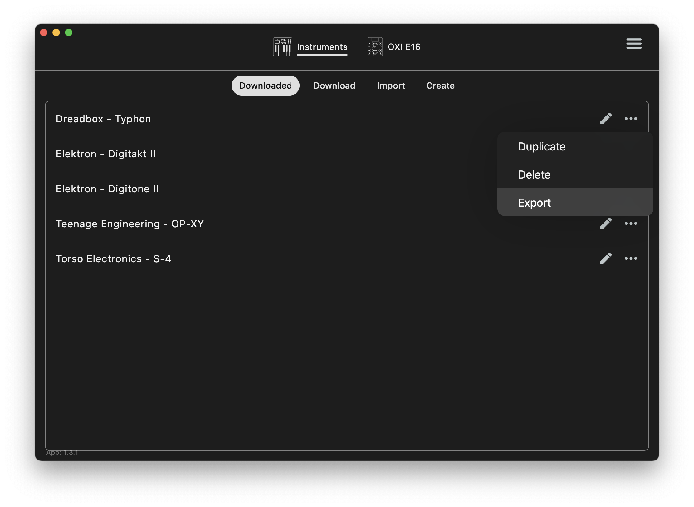

# OXI E16 Configuration

Tools and templates for creating `.oxie16` scene files for the [OXI E16](https://oxiinstruments.com/e16/) MIDI controller.

## Requirements

- [Node.js](https://nodejs.org/) (LTS recommended)

## Directory Structure

```
├── instruments/     # .oxiindef instrument definitions
├── scenes/          # .oxie16 compiled scene files
├── tmp/             # .json source files (gitignored)
├── icons/           # PNG icon source images
├── references/      # schema and template files
├── generate-scene.js
└── SKILL.md         # Claude skill documentation
```

## Scene Generator

`generate-scene.js` converts simplified JSON scene definitions into valid `.oxie16` files that can be loaded onto the OXI E16. When using the Claude skill, this is run automatically after creating or editing a scene.

It handles:

- Expanding encoder definitions with proper MIDI message formatting
- Auto-assigning LED colors based on parameter type (filter, envelope, LFO, etc.)
- Looking up default values from instrument definitions (`.oxiindef` files)
- Setting "push to reset" behavior on all mapped encoders
- Filling in disabled encoders and empty pages to meet the E16 format requirements

### Usage

```bash
node generate-scene.js tmp/my-synth.json scenes/my-synth.oxie16
```

### JSON source format

```json
{
  "title": "MySynth",
  "instrument": "MySynth.oxiindef",
  "icon": [0,0,8,0,20,0,34,0,0,0,65,0,0,0,128,128,0,0,0,65,0,0,0,34,0,20,0,8,0,0,0,0],
  "pages": [
    {
      "title": "Filter",
      "channel": 10,
      "type": "cc",
      "encoders": [
        {"abbr": "FREQ", "name": "Flt Freq", "cc": 16},
        {"abbr": "RESO", "name": "Flt Res", "cc": 17},
        {"abbr": "ENV", "name": "Flt Env", "cc": 24, "default": 64}
      ]
    }
  ]
}
```

### Encoder options

- `abbr` - 4-char abbreviation shown on E16 display
- `name` - Full parameter name
- `cc` - CC number (for CC type)
- `msb`, `lsb` - NRPN address (for NRPN type)
- `channel` - MIDI channel override (1-16)
- `default` - Reset value when encoder pushed
- `lower`, `upper` - Value range limits
- `color` - LED color (0-99), auto-assigned if omitted

## Included Instruments

- Digitakt II
- Digitone II
- OP-XY
- Torso S-4
- Typhon

You can export any other instrument definition from the [OXI App](https://oxiinstruments.com/support/) by clicking the menu on an instrument and selecting "Export":



## Claude Skill

This repo includes a Claude skill (`SKILL.md`) that teaches Claude how to create and edit OXI E16 scenes. Install with:

```bash
npx skills add brentvatne/oxi-e16-configuration -g
```

## License

MIT
